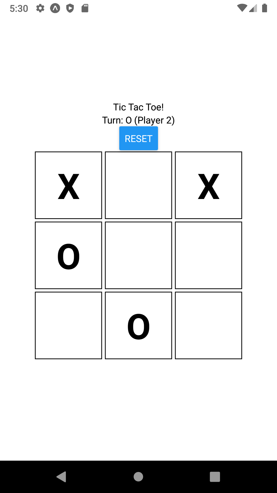
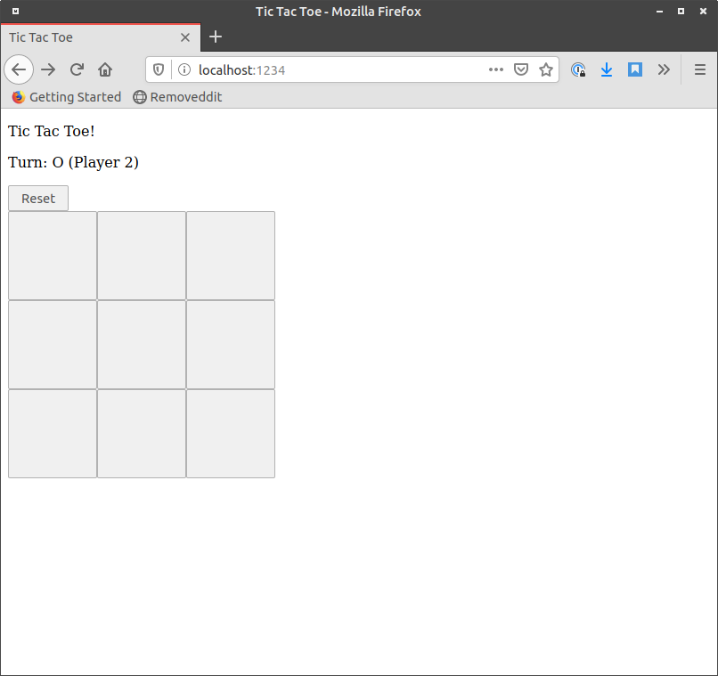

## Tic Tac Toe
<div style="display:flex">


</div>

### Initial Spec

 - Allow 2 players to play tic tac toe (Follow the rules of tic-tac-toe)
 - Have 3x3 grid on which the players can play
 - Allow the players to take turns marking spaces on the 3x3 grid
 - Recognize when a player has won and declare that player as victorious
 - Allow the user to start a new game

## Design

### Overview

The app is built in React for web and mobile and utilizes a shared React Hook which computes everything about the game.

* Board State: Which player has made which move on the board
* Winner: Which player won
* Turn: Whose turn it is
* onSelect: A function the UI can use to update Board State
* resetBoard: A function the UI can use to reset the board.

### Storing board state

I initially started with a board state as a 3x3 2D array that looked like this

```js
const boardState = [
  ["(1,1)", "(1,2)","(1,3)"]
  ["(2,1)", "(2,2)","(2,3)"]
  ["(3,1)", "(3,2)","(3,3)"]
]
```

However I kept encountering performance and render issues with this method because any time a value changed in `boardState` the entire TicTacToe board would re-render. My solution was to keep in a key-value pair that looks like this:

```js
const boardState = {
  11: 0,
  12: 0,
  13: 0
  .
  .
  .
}
```
Where the key the location on the board (ie 11 = (1,1)) and the value is either 0 for an empty space, 1 for a space taken by X and 2 by a space taken by O


### Computing a winner

This is the most verbose part of the program. I created a helper function called `computeRow` which checked if 3 numbers were the same, if they were it would return the number and if they were not all the same it would return 0.

From there I evaluated the 8 possible winning scenarios (rows 1-3, column 1-3 and 2 diagonals) as such.

```js
const row1 = computeRow(boardState[11], boardState[12], boardState[13]);
  if (row1 > 0) {
    return row1;
  }
```

All of this logic was hooked up to a useEffect within the hook that ran whenever `boardState` changed. Based on what was returned from the computation, we would then set the winner as either as 1 or 2 if a number greater than 0 is returned form the computing the winner.


### Computing a Tie

This was the easiest part of the computation, after computing the winner, if a winner is not found, we would the check if there is a tie by checking if there are any zero's left in `boardState`. If there are no zeros remaining (ie all 9 spaces are taken) and there is no winner, we can assume there is a tie.


## Running the code examples

### Running the web version

Inside the `web` directory, run `yarn` or `npm install` to install dependencies then `yarn start` or `npm run start` to start the webserver. The site will be accessible [localhost:1234](http://localhost:1234).


### Running the mobile version

The mobile version is bootstrapped with Expo. You can run it from the `mobile` directory by running `yarn` or `npm install` to install dependencies then running `yarn start` and the open the project using the Expo app on a simulator or physical device on the same network.